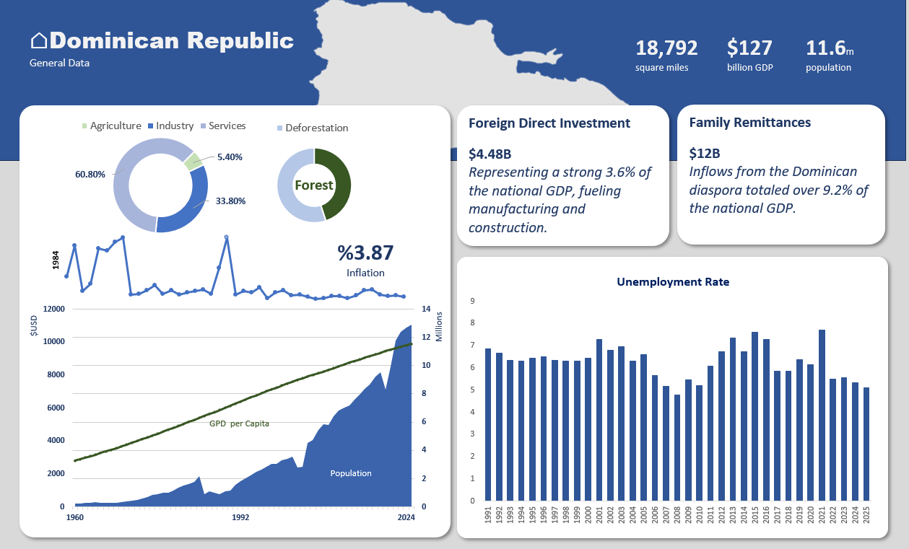
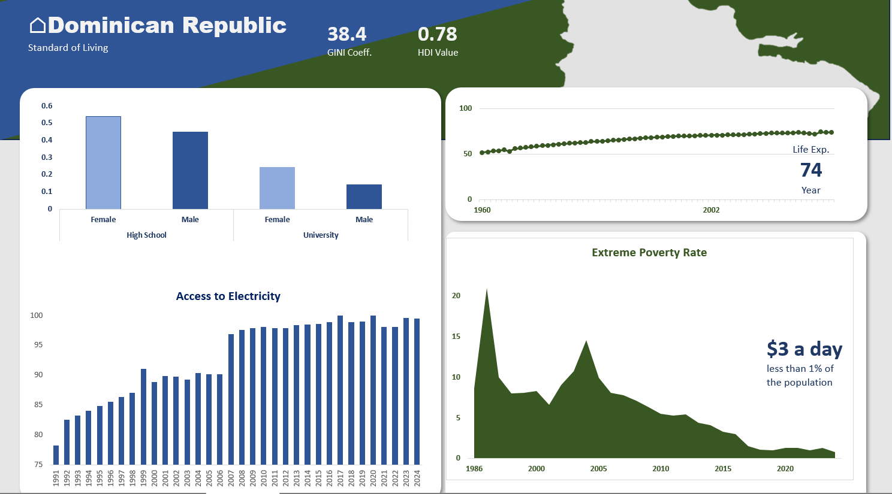

# Dominican Republic Economic & Wellbeing Dashboard 2026

## Overview
This is a data engineering and analytics solution focused on tracking the economic trends and social wellbeing of the Dominican Republic. The pipeline automatically ingests primary macroeconomic indicators like GDP, inflation, exchange rates, foreign direct investment, and public debt from the **Central Bank of the Dominican Republic** (Banco Central de la República Dominicana) using a Python web scrapers, while incorporating socio-economic context metrics from the **World Bank**. Data is processed through a Python ELT workflow and managed within a structured SQL Server database designed for scrape logging, version tracking, and auditability. Transformed data is then loaded into Excel via Power Query data models, powering dashboards and structured analytics that translate complex macroeconomic data into clear, accessible insights.

## Diagnostic & Historical Analysis

There has being a structural progress in the Dominican Republic's socio-economic landscape over recent decades. Macro-level health and infrastructure development are reflected in a Human Development Index of 0.78, continuous gains in life expectancy, and near universal access to electricity. On the socio-economic front, extreme poverty has plummeted to under 1% of the population rebounding after the 2003–2004 financial crisis and the improving GINI coefficient of 38.4 that indicates declining inequality. However, educational attainment data unveils a critical bottleneck: while high school completion rates remain solid but with space to improve, university completion drops sharply, reflecting significant drop-off between secondary education and advanced tertiary specialization.

This data demonstrates that while basic living standards and infrastructure coverage have stabilized upward, future productivity growth hinges on human capital development. The persistent gender gap in education, where females outpace males at both secondary and tertiary levels creates an opportunity for businesses to leverage educated female talent in high skill service. As extreme poverty reaches floor levels, economic policy must pivot from basic social safety nets toward upskilling the workforce to prevent the country from hitting a middle income trap. Forward looking strategies should focus on reforming tertiary education completion rates, aligning university curricula with modern tech and industrial needs, and ensuring infrastructure reliability as total energy demand and population expands.

## Technologies
- Python (scraping, ETL, automation)
- SQL Server (data storage, schema design)
- Excel (data consumption)
- GitHub (version control)

## Data Architecture & Pipeline Architecture

1. Scrape → `raw/` (Python)
2. Clean → `clean/` (Python)
3. Load → SQL Server Tracking Data
4. Import → Excel Power Query
5. Visualize → Descriptive and Predictive Excel dashboards
6. Analytics → Written dignostics and prescriptive analysis

## Structure
- `assets/` → screen captures of the project
- `raw/` → raw scraped and downloaded files
- `clean/` → cleaned datasets
- `sql/` → SQL schema and scripts
- `scripts/` → Python pipeline scripts

## Objectives
- Modular Python scripts for reproducibility
- SQL schema design for scrape tracking storage
- Logging and error handling in ELT
- Version control with Git and GitHub
- Future: scheduling jobs for automation
